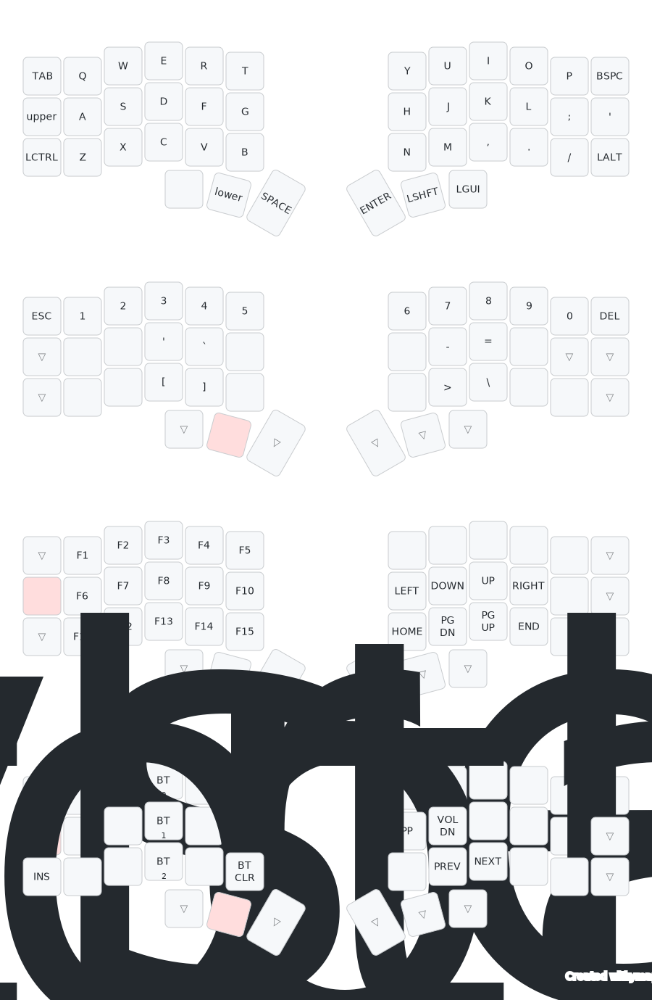

# ZMK Configuration - Corne - 

This repository contains my [ZMK](https://zmk.dev/) configuration for a [Corne V3](https://github.com/foostan/crkbd) keyboard.

## Keymap Cheat Sheet

> Keymap generated by [Caksoylar](https://github.com/caksoylar/keymap-drawer).

## Getting started

**Are you trying to make your own ZMK firmware?**  
[Here are the steps you need to take.](./GETTING_STARTED.md)

**Do you want to download my keymap?**  

[Download the firmware zip from the latest action run.](https://github.com/TahomaTech/zmk-config-corne/actions) Check [the ZMK docs](https://zmk.dev/docs/user-setup#installing-the-firmware) for instructions on how to flash it.